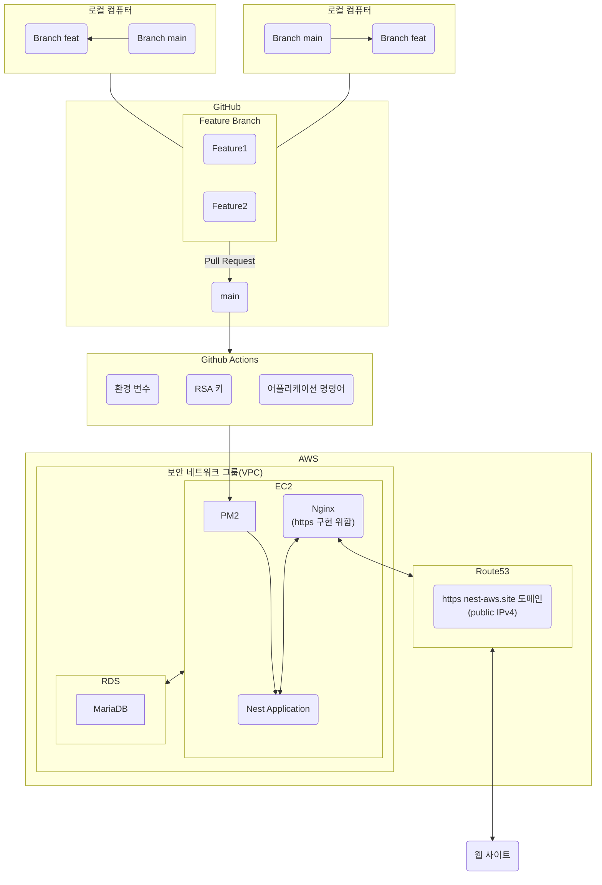
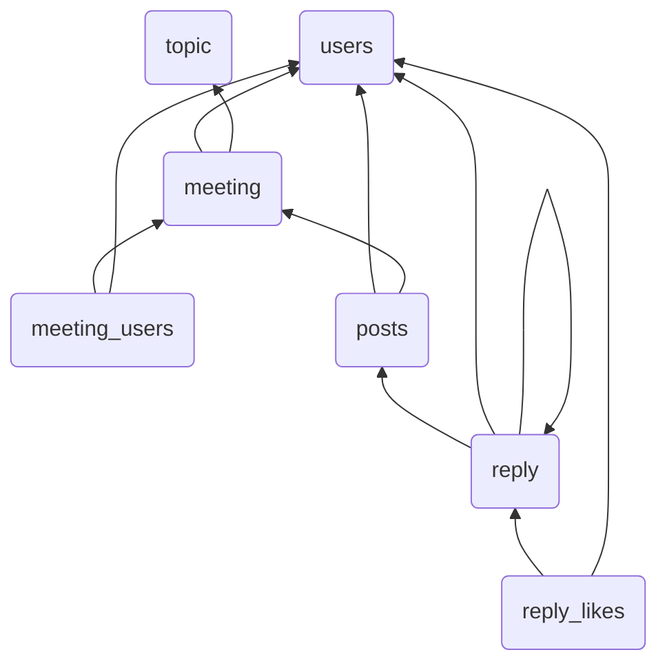

  

[circleci-image]: https://img.shields.io/circleci/build/github/nestjs/nest/master?token=abc123def456
[circleci-url]: https://circleci.com/gh/nestjs/nest

## Description

## Project setup

## Deployment

## Table Relation

## Support

## License

Nest is [MIT licensed](https://github.com/nestjs/nest/blob/master/LICENSE).
