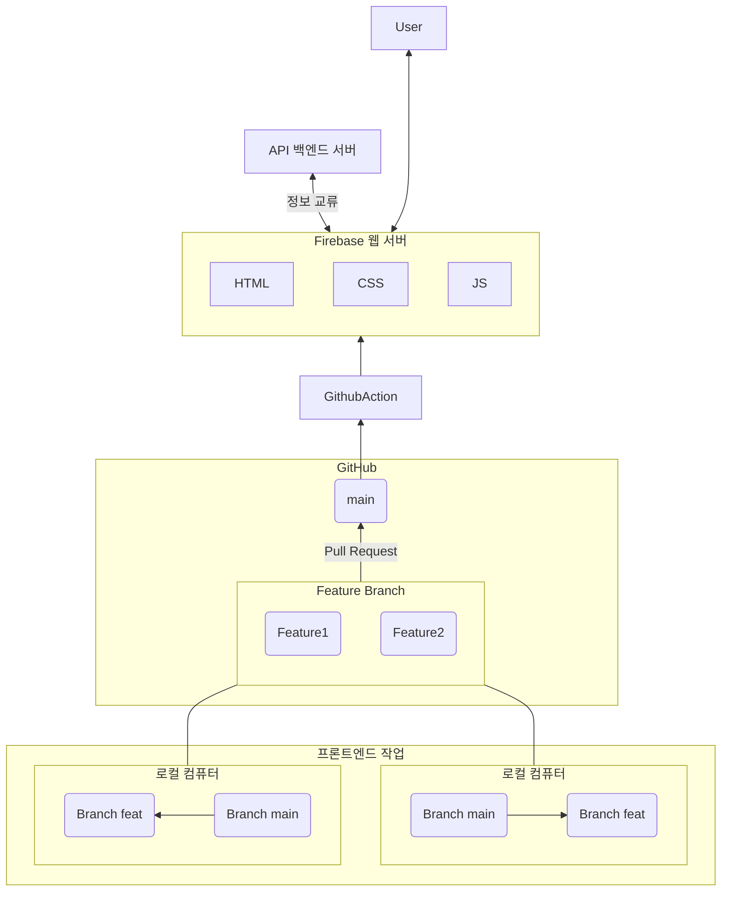

```mermaid
flowchart BT
    
subgraph Front ["프론트엔드 작업"]
    subgraph Local1 ["로컬 컴퓨터"]
        direction RL
        Local-branch-main1("Branch main")
        Local-branch-feat1("Branch feat")

        Local-branch-main1 --> Local-branch-feat1
    end
    subgraph Local2 ["로컬 컴퓨터"]
        direction LR
        Local-branch-main2("Branch main")
        Local-branch-feat2("Branch feat")

        Local-branch-main2 --> Local-branch-feat2
    end
end

    subgraph GitHubRepo ["GitHub"]
        direction BT
        subgraph feature ["Feature Branch"]
            Github-Branch-feat1("Feature1")
            Github-Branch-feat2("Feature2")
        end

        Github-Branch-main("main")
        feature -- Pull Request --> Github-Branch-main
    end

Local1 --- feature
Local2 --- feature

GithubAction

Github-Branch-main --> GithubAction

subgraph Firebase ["Firebase 웹 서버"]
    HTML
    CSS
    JS
end

GithubAction --> Firebase

User

Firebase <----> User

Firebase <-- 정보 교류 --> Backend["API 백엔드 서버"]
```